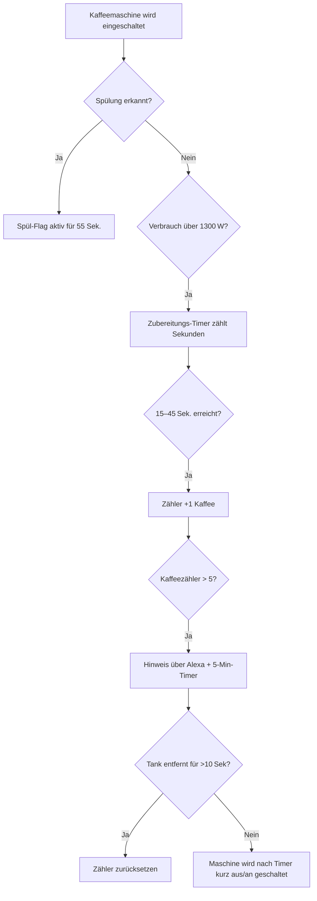

# ☕ Smarter Kaffeevollautomat – Verhaltenserkennung mit Home Assistant

Erkenne automatisch, wann Kaffee gebrüht, gespült oder Wasser nachgefüllt wird – ganz ohne API, direkt über Strom- und Zeiterfassung.

> ⚠️ Hinweis: Der Start der Kaffeezubereitung erfolgt weiterhin manuell. Diese Lösung erkennt zuverlässig, **wann** Kaffee zubereitet wird, **wann gespült** wird, **wann der Wassertank leer ist** und **wann die Maschine abgeschaltet werden sollte**.

## 📋 Inhalte

1. 💡 [Einleitung](./Einleitung.md)
2. 🔍 [Benötigte Datenquellen und Messwerte](./Benötigte%20Datenquellen%20und%20Messwerte.md)
3. 🧰 [Geräte & Sensor-Voraussetzungen](./Geräte.md)
4. 🛠️ [Helfer (Helpers)](./Helfer.md)
5. 🧪 [Template Sensoren](./Template%20Sensoren.md)
6. ⚙️ Automationen:

   * [Kaffeezubereitung erkennen](./Kaffeezubereitung%20erkennen.md)
   * [Spülvorgang erkennen](./Delongi%20Spülen%20erkennen.md)
   * [Timer & Abschaltung](./Timer%20%26%20Abschaltung.md)
   * [Wassertank – Zähler zurücksetzen](./Wassertank%20–%20Zähler%20zurücksetzen.md)

## 🧠 Voraussetzungen

* Home Assistant mit funktionierendem Stromsensor (z. B. Shelly Plug, Gosund Tasmota etc.)
* Der Stromverbrauch des Vollautomaten sollte in Echtzeit verfügbar sein
* Die Maschine muss bei erneutem Einschalten **nicht automatisch spülen**, sonst führt dies zu Fehlauslösungen

## 🖼️ Beispielhafter Ablauf (vereinfacht)

## 📄 Lizenz

Dieses Projekt steht unter der **MIT-Lizenz** – frei zur Nutzung, Anpassung und Weitergabe.

---

Viel Freude mit deinem smarten Kaffee-Setup – für mehr Komfort, Kontrolle und Koffein ☕⚡
